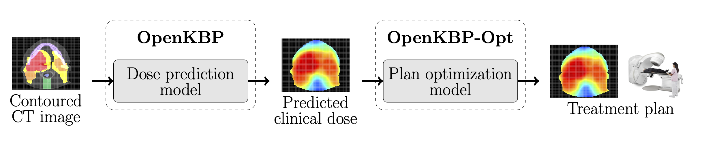

# open-kbp
This repository provides the code for the PyTorch implementation of the [open-kbp](https://github.com/ababier/open-kbp), and here is the original [paper](https://aapm.onlinelibrary.wiley.com/doi/epdf/10.1002/mp.14845).
 
## Data
The details of the provided data are available in the paper [OpenKBP: The open-access knowledge-based planning grand challenge and dataset](https://aapm.onlinelibrary.wiley.com/doi/epdf/10.1002/mp.14845). In short, it provides data for 340 patients who were treated for head-and-neck cancer with intensity modulated radiation therapy. The data is split into training (*n*=200), validation (*n*=40), and testing (*n*=100) sets. Every patient in these datasets has a dose distribution, CT images, structure masks, a feasible dose mask (i.e., mask of where dose can be non-zero), and voxel dimensions.

## For running on a local machine
- Linux
- Python 3.10.9
- Nvidia GeForce RTX 3090 GPU

## Created folder structure
This repository will create a file structure that branches from a directory called _open-kbp_. The file structure will keep information about predictions from a model (called baseline in this example) and the model itself in the _results_ directory. All the data from the OpenKBP competition (with the original train/validation/test splits) is available under the directory called _provided-data_. This code will also make a directory called _submissions_ to house the zip files that can be submitted to the leader boards on CodaLab. Use this folder tree as a reference (it will more or less build itself).
   
```
open-kbp
├── provided-data
│   ├── train-pats
│   │   ├── pt_*
│   │       ├── *.csv
│   ├── valid-pats
│   │   ├── pt_*
│   │       ├── *.csv
│   └── test-pats
│       ├── pt_*
│           ├── *.csv
├── results
│   ├── baseline
│   │   ├── models
│   │   │   ├── epoch_*.pt
│   │   ├── validation-predictions
│   │   │   ├── pt_*.csv
│   │   └── test-predictions
│   │       ├── pt_*.csv
│   ├── **Structure repeats when new model is made**
└── submissions
    ├── baseline.zip
    ├── **Structure repeats when new model is made**   

```
## Creating the virtual environment

    conda create -n my_env python=3.10.9

## Getting started

    git clone https://github.com/bravePinocchio/open-kbp
    cd open-kbp
    pip install -r requirements.txt


## Running the code

    CUDA_VISIBLE_DEVICES=0 python main.py
    

